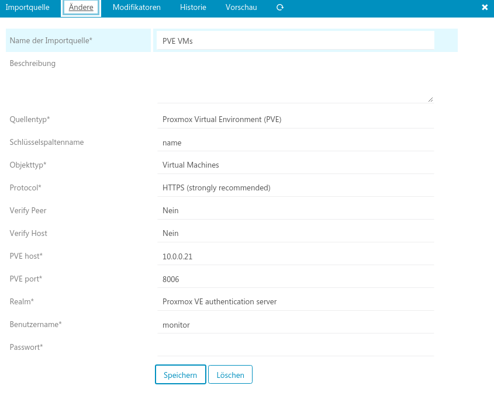
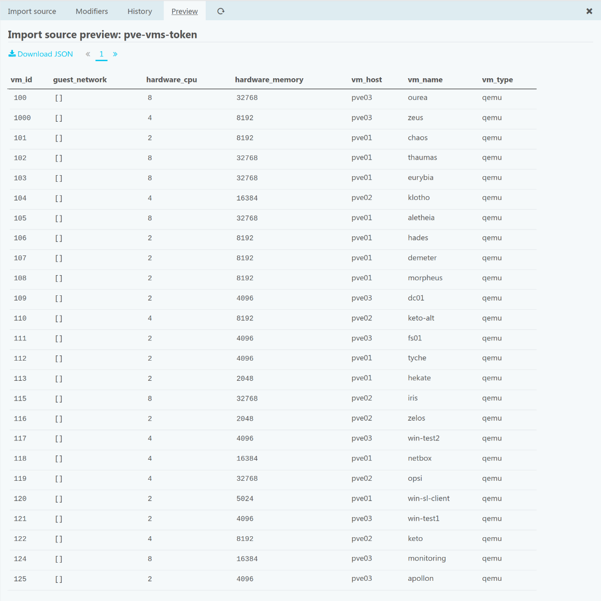

# Proxmox VE (PVE) module for Icinga Web 2

#### Table of Contents

1. [About](#about)
2. [License](#license)
3. [Documentation](#documentation)
4. [Support](#support)
5. [Requirements](#requirements)
6. [Thanks](#thanks)
7. [Contributing](#contributing)

## About

This module allows you to easly monitor your [Proxmox VE](https://www.proxmox.com) (PVE) hosts and VMs, by providing an Icinga Director import source and check commands.

## License

Icinga Web 2 and this Icinga Web 2 module are licensed under the terms of the GNU General Public License Version 2, you will find a copy of this license in the LICENSE file included in the source package.

## Documentation

* [Installation](doc/01-Installation.md)

## Support

Join the [Icinga community channels](https://www.icinga.com/community/get-involved/) for questions.

## Requirements

* [Icinga Web 2](https://www.icinga.com/products/icinga-web-2/) (>= 2.4.1)
* [Icinga Director](https://github.com/icinga/icingaweb2-module-director) (>= 1.3.0)

## Thanks

This module borrows a lot from https://github.com/Icinga/icingaweb2-module-vsphere.

## Contributing

There are many ways to contribute to the Proxmox VE (PVE) module for Icinga Web 2 --
whether it be sending patches, testing, reporting bugs, or reviewing and
updating the documentation. Every contribution is appreciated!

Please continue reading in the [contributing chapter](CONTRIBUTING.md).
