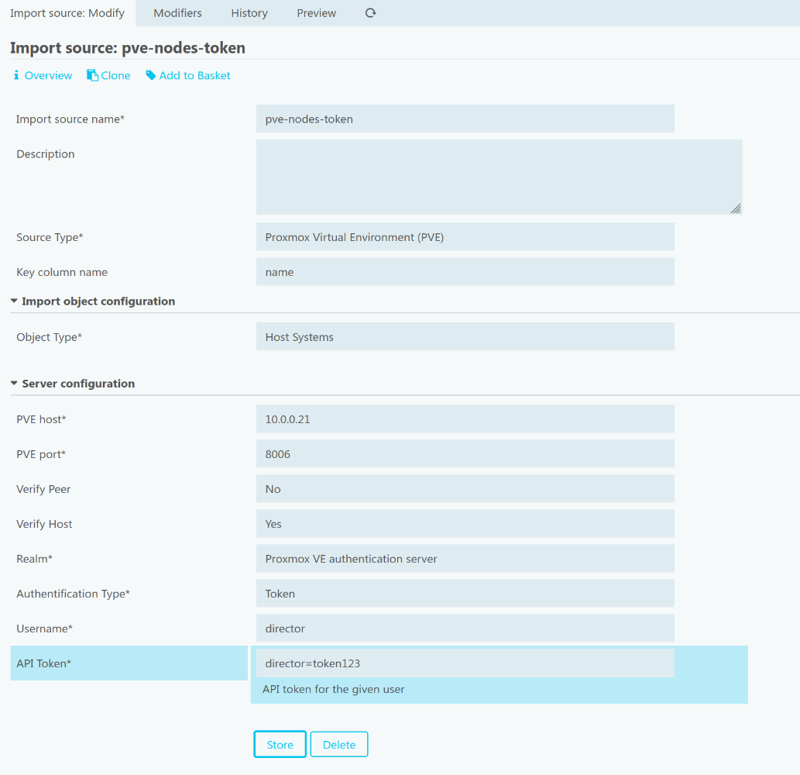

# Configuration

## Create Proxmox VE user

The module needs a Proxmox VE user with at least the following permissions:

- `VM.Audit`
- `Pool.Audit`
- `Sys.Audit`

> **Note**: If the values from QEMU guest agent should be fetch too, additionally the permission `VM.Monitor` is required.

For authentification either a API token or the users password can be used. It is highly recommended to use the API token though.

See the official Proxmox VE documentation for more information on how to create user, role and API token.

## Create an import source

### General

At the moment `icingaweb2-module-pve` can import PVE nodes, virtual machines / lxc container, storage and resource pools.

The following steps are necessary for all kinds of object types. Below you find additional instructions, which are specific to certain object types.

1. Create a new import source in Director
2. Select `Proxmox Virtual Environment (Proxmox VE)` in the `Source Type` list
3. Configure the host details according to your local setup (section `Server configuration`)

### Nodes (object type `Host Systems`)

Create an import source and perform the basic configuration as described above.

Additionall steps:

- Choose `Host Systems` in the `Object Type` list
- Set the `Key column name` (usually `name` for a node)

The following fields are imported (fields marked with `*` are optional):

| name | type | description | example |
|------|------|-------------|---------|
| `vm_id` | integer | Unique id of the virtual machine / lxc container (can be used as key column) | `123` |
| `vm_name` | string | Name of the virtual machine / lxc container | `srv-db01` |
| `vm_pool` | string | Assigned resource pool (empty if none) | `Web servers` |
| `vm_type` | string | `qemu` if VM or `lxc` if container | `Web servers` |
| `vm_host` | string | Name of the PVE node where the virtual machine / lxc container is running | `pve10` |
| `hardware_cpu` | integer | number of assigned cpu cores | `4` |
| `hardware_memory` | integer | amount of assigned memory in megabytes | `32768` |
| `guest_network` \* | object | MAC address and ip addresses (IPv4 and IPv6). On virtual machines this field is only populated if the qemu guest agent is running and the import source has set the configuration option `Fetch Guest Agent data` to `yes` (needs additional request, thus might be slow in larger environments) | <pre>{ &emsp;ens18: { &emsp;&emsp;hwaddr: "aa:bb:cc:dd:ee:ff", &emsp;&emsp;ipv4: [ &emsp;&emsp;&emsp;"192.168.42.42/24" &emsp;&emsp;], &emsp;&emsp;ipv6: [ &emsp;&emsp;&emsp;"fe80::5c11:45ff:fe05:2ca3/64" &emsp;&emsp;] &emsp;} }</pre> |
| `vm_ha` \* | bool | Is the VM or container managed by the high availability service. This field is only present if the import source has set the configuration option `Fetch VM HA state` to `yes` (needs additional request, thus might be slow in larger environments). | `true` |
| `description` \* | string | Optional description field of the VM or container. This field is only present if the import source has set the configuration option `Fetch VM config` to `yes` (needs additional request, thus might be slow in larger environments). | `Web server for customer ACME corp.` |
| `os_type` \* | string | Optional operating system type field of the VM or container. This field is only present if the import source has set the configuration option `Fetch VM config` to `yes` (needs additional request, thus might be slow in larger environments). | `win10` |

### Virtual Machines / LXC Container (object type `Virtual Machines`)

Create an import source and perform the basic configuration as described above.

Additionall steps:

- Choose `Virtual Machines` in the `Object Type` list
- Set the `Key column name` (usually `vm_id` or `vm_name` for a virtual machine)

The following fields are imported (fields marked with `*` are optional):

| name | type | description | example |
|------|------|-------------|---------|
| `name` | string | Hostname of the node (matches display value as in PVE UI) | `pve01` |
| `cpu` | integer | Number of host cpu threads | `32` |
| `memory` | integer | Amount of host memory in bytes | `135030501376` |

### Storage (object type `Storages`)

Create an import source and perform the basic configuration as described above.

Additionall steps:

- Choose `Storages` in the `Object Type` list
- Set the `Key column name` (usually `storage_id` for a resource pool)

The following fields are imported (fields marked with `*` are optional):

| name | type | description | example |
|------|------|-------------|---------|
| `storage_id` | string | Unqiue identifier of the storage node / node combiniation | `pve10/rpool` |
| `node` | string | Name of the node, where storage is located | `pve10` |
| `name` | string | Name of the storage node (matches display value as in PVE UI) | `rpool` |
| `capacity` | integer | Capacity of the storage in bytes | `8057125208064` |
| `content` | list | Allowed content for this storage. Values are separated by comma (split with a modifier) | `rootdir,images,iso,vztmpl,backup` |
| `shared` | bool | Indicates if a pool is shared across the cluster (`true` when field `nodes` is empty) | - |
| `type` | string | storage type | `zfspool` |

### Resource Pools (object type `Pools`)

Create an import source and perform the basic configuration as described above.

Additionall steps:

- Choose `Pools` in the `Object Type` list
- Set the `Key column name` (usually `pool_id` for a resource pool)

The following fields are imported (fields marked with `*` are optional):

| name | type | description | example |
|------|------|-------------|---------|
| `pool_id` | string | Identifier / display name of the pool (matches display value as in PVE UI) | `Web servers` |
| `comment` | string | Optional descriptive comment of the pool | `Pool contains all customer webservers` |
